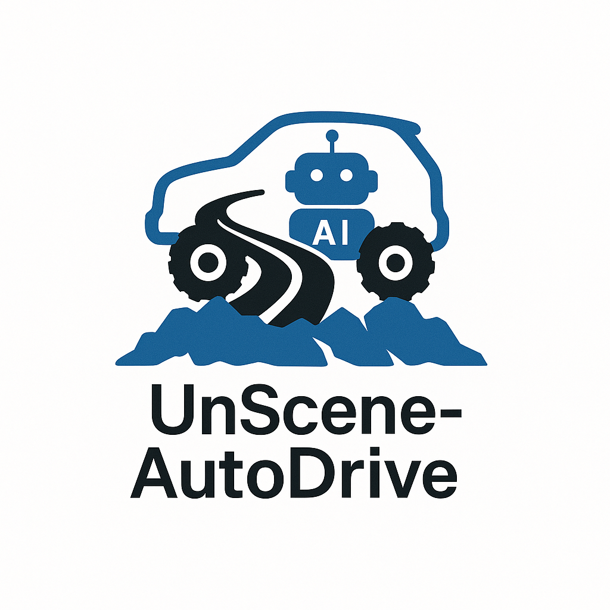

# 🌍 UnScene-AutoDrive

> A Unified Suite for Autonomous Driving in Unstructured Scenes

**UnScene-AutoDrive** is the official entry point to a family of research projects addressing the challenges of autonomous driving in rugged, irregular, and label-sparse environments.

---

## 🔗 Ecosystem Projects

- [**UnsOcc**](https://github.com/your-org/UnsOcc): Semantic 3D occupancy prediction with render-aware fusion.
- [**UnSceneDrive**](https://github.com/your-org/UnSceneDrive): End-to-end driving with vision-language reasoning.
- [**UnSceneData**](https://github.com/your-org/UnSceneData): Dataset tools for open-pit mines and off-road scenes.

