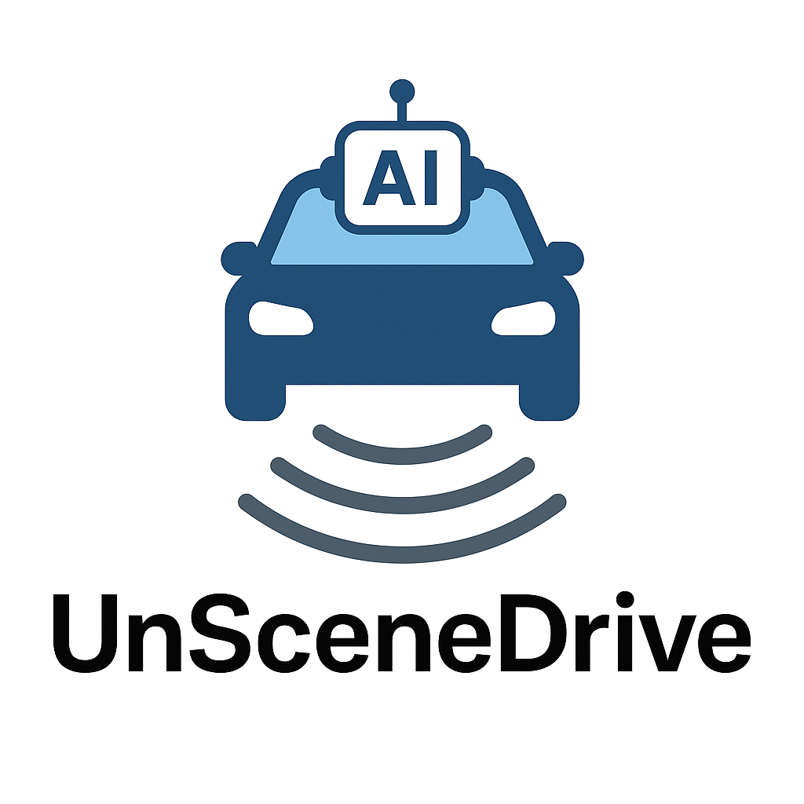

# 🔷 UnsDrive

> End-to-End Driving Policy for Unstructured Scenes

- 🔗 [GitHub Repo](https://github.com/songruiqi/UnsDrive)
- 📄 [Documentation](https://songruiqi.github.io/UnsDrive/)
- 🧠 Features: LLaVA + CoT reasoning + diffusion trajectory
