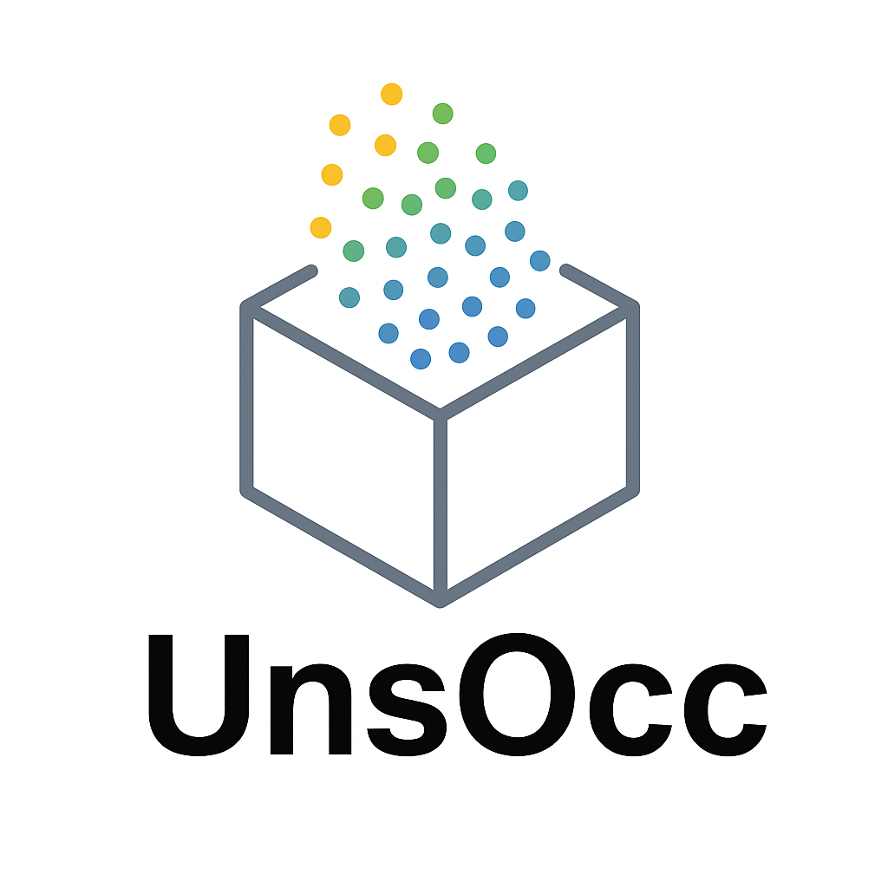

# 🔷 UnsOcc

> 3D Semantic Occupancy Prediction for Unstructured Scenes

- 🔗 [GitHub Repo](https://github.com/songruiqi/UnsOcc)
- 📄 [Documentation](https://songruiqi.github.io/UnsOcc/)
- 📦 Tasks: Voxel prediction, long-tail BEV segmentation, GS refinement
